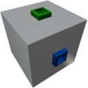

  

| Component | `InfiniteData` |
|---|---|
|**Module**|`Archean_mod`|
|**Mass**|1 kg|
|[**Size**](# "Based on the component's occupancy in a fixed 25cm grid.")|25 x 25 x 25 cm|
#
---

# Description
Infinite Data is a component that outputs user specified data on the blue dataport.

# Usage
Connect the blue dataport. Then you can configure outputs via the **V** menu or the green dataport.  
If `Only output changes` is active `Recieved Data` will only contain data that has changed since last tick.

### List of inputs
| Channel | Function | Value |
|---|---|---|
| 0 | Enable input output | `0` or `1` |
| 1 | Send Data | [Key-value](https://wiki.archean.space/xenoncode/documentation.md#key-value-objects) (`.c0{data}` ... `.c19{data}`) |
| 2 | Only output changes | `0` or `1` |

### List of outputs
| Channel | Function | Value |
|---|---|---|
| 0 | Recieved Data | [Key-value](https://wiki.archean.space/xenoncode/documentation.md#key-value-objects) (`.c0{data}`) |
