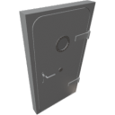

  

| Component | `AirtightDoorR` |
|---|---|
|**Module**|`Archean_mod`|
|**Mass**|50 kg|
|[**Size**](# "Based on the component's occupancy in a fixed 25cm grid.")|125 x 25 x 225 cm|
#
---

# Description
Manual use airtight Door. Can be locked but not opened with data signals.  
Always airtight even when open.

# Usage
Press on the door to open/close.  
Press on the round handle to lock/unlock.

Door can be locked from the dataport.

### List of inputs
| Channel | Function | Value |
|---|---|---|
| 0 | Lock door | `0` or `1` |

### List of outputs
| Channel | Function | Value |
|---|---|---|
| 0 | door open | `0` or `1` |
| 1 | door locked | `0` or `1` |
| 2 | player press | `0` or `1` |
