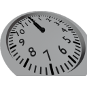

  

| Component | `Clock` |
|---|---|
|**Module**|`MANNCHEN_clock`|
|**Mass**|0.1 kg|
|[**Size**](# "Based on the component's occupancy in a fixed 25cm grid.")|50 x 50 x 25 cm|
#
---

# Description
A Clock that can display either the real world time or a time supplied via the data port.

# Usage
In normal mode the Clock will display the time from input 0 in seconds from 0:00.  

If `show real time` is checked the clock will instead show the real world time.  

> In real time mode you can use the `Hour Offset` slider to adjust the time zone.

### List of inputs
| Channel | Function | Value |
|---|---|---|
| 0 | Time (s) | Number |

