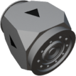

  

| Component | `CheckValve` |
|---|---|
|**Module**|`MANNCHEN_fluids`|
|**Mass**|1 kg|
|[**Size**](# "Based on the component's occupancy in a fixed 25cm grid.")|25 x 25 x 25 cm|
|**Push/Pull Fluid**| accept Push/Pull -> forwards action to other side|
#
---

# Description
The Check Valve will only let fluid pass in one direction, indicated by the arrow on the side.
