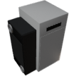

  

| Component | `Chiller` |
|---|---|
|**Module**|`MANNCHEN_fluids`|
|**Mass**|200 kg|
|[**Size**](# "Based on the component's occupancy in a fixed 25cm grid.")|125 x 100 x 175 cm|
|**Push/Pull Fluid**| accept Push/Pull -> forwards action to other side|
#
---

# Description
The Chiller cools fluids pumped through the fluid ports on the side down to a selected temperature.

# Usage
Pump fluid through the fluid ports on the side. The Chiller will cool the fluid to the temperature selected via the 
screen or data input.  
The Chiller needs a data signal on channel 0 and power to operate.  
The heat removed from the fluid and waste heat is transfered into the component and must be removed by pumping fluid 
through the fluid ports in the back.
Fluid can only be cooled to 150K below the Chiller's core temperature.  
The Chiller can consume up to 2MW of power.

> The chiller has no internal fluid buffer. Make sure the fluid has somewhere to go or no fluid will flow
> (pumping a full tank into itself will not work).

### List of inputs
| Channel | Function | Value |
|---|---|---|
| 0 | On/Off | `0` or `1` |
| 1 | Target temperature | Kelvin |

### List of outputs
| Channel | Function | Value |
|---|---|---|
| 0 | Fluid output temperature | Kelvin |
| 1 | Coolant output temperature | Kelvin |
