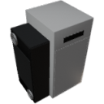

  

| Component | `Chiller` |
|---|---|
|**Module**|`MANNCHEN_fluids`|
|**Mass**|200 kg|
|[**Size**](# "Based on the component's occupancy in a fixed 25cm grid.")|125 x 100 x 175 cm|
|**Push/Pull Fluid**| Accept Push, Initiate Push |
#
---

# Description
The Chiller is a component that cools down fluids to a selected temperature.
transfering the heat into another fluid.

# Usage
Push fluid into the fluid input on the side of the component. The Chiller will cool the fluid to the temperature selected via the 
screen or data input.  
The Chiller needs a data signal on channel 0 and power to operate.  
The heat removed from the fluid and extra waste heat is transfered into the component core and must be removed by pumping fluid into the back of the component as coolant.
The Chiller will push fluid out through output ports on the same side. It can also hold a small amount of fluid and coolant.  
Fluid can only be cooled to 300K below the Chiller's core temperature.  
The Chiller can consume up to 2MW of power.  

### List of inputs
| Channel | Function | Value |
|---|---|---|
| 0 | On/Off | `0` or `1` |
| 1 | Target temperature | Kelvin |

### List of outputs
| Channel | Function | Value |
|---|---|---|
| 0 | Fluid output temperature | Kelvin |
| 1 | Coolant output temperature | Kelvin |
