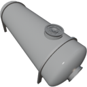

  

| Component | `HeatExchanger` |
|---|---|
|**Module**|`MANNCHEN_fluids`|
|**Mass**|100 kg|
|[**Size**](# "Based on the component's occupancy in a fixed 25cm grid.")|75 x 200 x 75 cm|
|**Push/Pull Fluid**| accept Push/Pull, forwards action to other side|
#
---

# Description
The HeatExchanger transfers heat between fluid pumped through the top, bottom (shell) and front, back (tube).
The HeatExchanger has an internal heat buffer and will store some heat.
