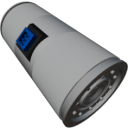

  

| Component | `InlineTank` |
|---|---|
|**Module**|`MANNCHEN_fluids`|
|**Mass**|10 kg|
|[**Size**](# "Based on the component's occupancy in a fixed 25cm grid.")|25 x 25 x 50 cm|
|**Push/Pull Fluid**| accept Push/Pull|
#
---

# Description
A small Tank with two fluid ports.

Capacity: `0.02 m³`

### List of outputs
| Channel | Function | Value |
|---|---|---|
| 0 | Fluid level | `0.0` to `1.0` |
| 1 | Fluid content | [Key-value](https://wiki.archean.space/xenoncode/documentation.md#key-value-objects) |
| 2 | Fluid temperature | Kelvin |
