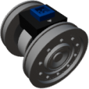

  

| Component | `PipeSensor` |
|---|---|
|**Module**|`MANNCHEN_fluids`|
|**Mass**|1 kg|
|[**Size**](# "Based on the component's occupancy in a fixed 25cm grid.")|25 x 25 x 25 cm|
|**Push/Pull Fluid**| accept Push/Pull, forwards action to other side|
#
---

# Description
PipeSensor is a component that outputs information about fluid flow, temperature and composition through a pipe.
Flow is measured directionally, and flow in both directions will cancel each other out.
Composition is mass not percentage.

### List of outputs
| Channel | Function | Value |
|---|---|---|
| 0 | Flow | `0.0` to `1.0` |
| 1 | Temperature | Kelvin |
| 2 | Composition | [Key-value](https://wiki.archean.space/xenoncode/documentation.md#key-value-objects) |
