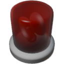

  

| Component | `RotaryLight` |
|---|---|
|**Module**|`MANNCHEN_lights`|
|**Mass**|2 kg|
|[**Size**](# "Based on the component's occupancy in a fixed 25cm grid.")|25 x 25 x 25 cm|
#
---

# Description

A rotating light typically used to signal danger. Rotation speed and light output / color  are adjustable.

> Tip: Instead of adjusting the light color you can paint the glass for a more authentic look.

### List of inputs
| Channel | Function | Value |
|---|---|---|
| 0 | On | `0` or `1` |
| 1 | Light | `0.0` to `1.0` or _color_ |
| 2 | Rotation speed (multiplier) | Number |

