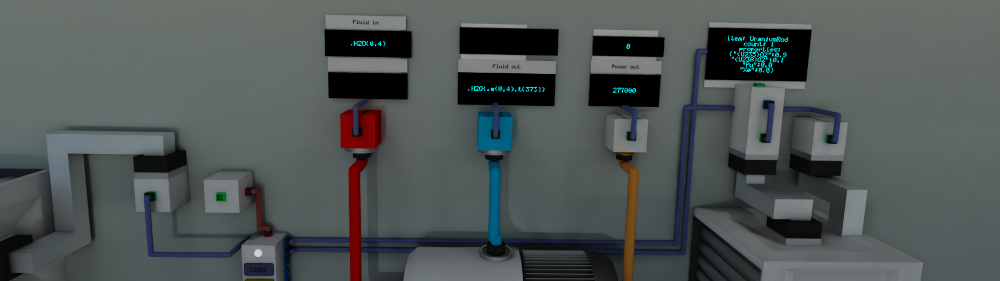

# Archean Mods

- Mods
  - [Infinite](#Infinite)
  - [Clock](#Clock)
  - [ValveHandle](#ValveHandle)
- [Install](#Install)

---

## Infinite

Configurable infinite power, fluid, item, and data sources and consumers. All come with data ports for statistics
collection or automated configuration.

#### Documentation:
- [InfiniteData](./Infinite/InfiniteData/InfiniteData.md)
- [InfiniteFluid](./Infinite/InfiniteFluid/InfiniteFluid.md)
- [InfiniteHV](./Infinite/InfiniteHV/InfiniteHV.md)
- [InfiniteItems](./Infinite/InfiniteItems/InfiniteItems.md)
- [InfiniteLV](./Infinite/InfiniteLV/InfiniteLV.md)

## Clock

Analog clock that can display the real world time, or any time you want.

#### Documentation:
- [Clock](./Clock/Clock.md)

## ValveHandle

Simple valve looking component that behaves like a switch.

#### Documentation:
- [ValveHandle](./ValveHandle/ValveHandle.md)

## AirtightDoor

Marine style manually operated airtight door.

#### Documentation:
- [AirtightDoorL](./AirtightDoor/AirtightDoorL/AirtightDoorL.md)
- [AirtightDoorR](./AirtightDoor/AirtightDoorR/AirtightDoorR.md)

---

## Install

- download the latest release zip
  - [Clock.zip](https://github.com/Mannchen/Archean-Mods/releases/latest/download/Clock.zip)
  - [Infinite.zip](https://github.com/Mannchen/Archean-Mods/releases/latest/download/Infinite.zip)
  - [ValveHandle.zip](https://github.com/Mannchen/Archean-Mods/releases/latest/download/ValveHandle.zip)
  - [AirtightDoor.zip](https://github.com/Mannchen/Archean-Mods/releases/latest/download/AirtightDoor.zip)
  - [_All-mods.zip](https://github.com/Mannchen/Archean-Mods/releases/latest/download/_All-mods.zip)

- unzip and copy the components you want into `Archean-game/modules/ARCHEAN_mod/components`
