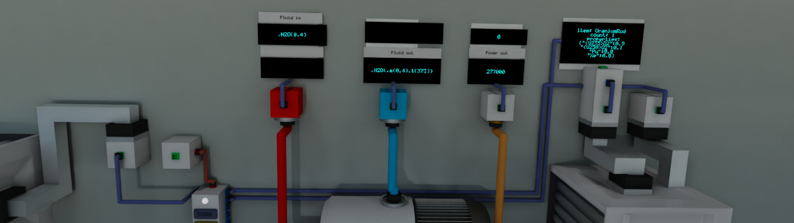
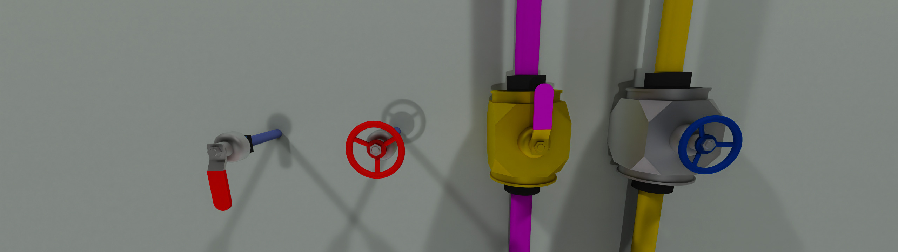

# Archean Mods

- Mods
  - [Infinite](#Infinite)
  - [Clock](#Clock)
  - [ValveHandle](#ValveHandle)
  - [AirtightDoor](#AirtightDoor)
  - [Lights](#Lights)
- [Install](#Install)

---

## Infinite

Configurable infinite power, fluid, item, and data sources and consumers. All come with data ports for statistics
collection or automated configuration.

#### Documentation:
- [InfiniteData](./MANNCHEN_infinite/components/InfiniteData/InfiniteData.md)
- [InfiniteFluid](./MANNCHEN_infinite/components/InfiniteFluid/InfiniteFluid.md)
- [InfiniteHV](./MANNCHEN_infinite/components/InfiniteHV/InfiniteHV.md)
- [InfiniteItems](./MANNCHEN_infinite/components/InfiniteItems/InfiniteItems.md)
- [InfiniteLV](./MANNCHEN_infinite/components/InfiniteLV/InfiniteLV.md)

## Clock

Analog clock that can display the real world time, or any time you want.

#### Documentation:
- [Clock](./MANNCHEN_clock/components/Clock/Clock.md)

## ValveHandle

Simple valve looking component that behaves like a switch.

#### Documentation:
- [ValveHandle](./MANNCHEN_valvehandle/components/ValveHandle/ValveHandle.md)

## AirtightDoor

Marine style manually operated airtight door.

#### Documentation:
- [AirtightDoorL](./MANNCHEN_airtightdoor/components/AirtightDoorL/AirtightDoorL.md)
- [AirtightDoorR](./MANNCHEN_airtightdoor/components/AirtightDoorR/AirtightDoorR.md)

## Lights

A collection of different types of light components.

### Documentation
- [RotaryLight](./MANNCHEN_lights/components/RotaryLight/RotaryLight.md)

---

## Install

### get the mods from the steam workshop
[My workshop Page](https://steamcommunity.com/id/mannchen_46/myworkshopfiles?browsefilter=myfiles&sortmethod=creationorder&section=items&appid=2941660&requiredtags%5B%5D=components)
 
or

### download the latest release zip
  - [MANNCHEN_clock.zip](https://github.com/Mannchen/Archean-Mods/releases/latest/download/MANNCHEN_clock.zip)
  - [MANNCHEN_infinite.zip](https://github.com/Mannchen/Archean-Mods/releases/latest/download/MANNCHEN_infinite.zip)
  - [MANNCHEN_valvehandle.zip](https://github.com/Mannchen/Archean-Mods/releases/latest/download/MANNCHEN_valvehandle.zip)
  - [MANNCHEN_airtightdoor.zip](https://github.com/Mannchen/Archean-Mods/releases/latest/download/MANNCHEN_airtightdoor.zip)
  - [MANNCHEN_lights.zip](https://github.com/Mannchen/Archean-Mods/releases/latest/download/MANNCHEN_lights.zip)
  - [_All-mods.zip](https://github.com/Mannchen/Archean-Mods/releases/latest/download/_All-mods.zip)

- unzip and copy the mods you want into `...steamapps/common/Archean/Archean-data/mods/`.
