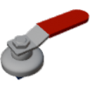

  

| Component | `ValveHandle` |
|---|---|
|**Module**|`Archean_mod`|
|**Mass**|0.1 kg|
|[**Size**](# "Based on the component's occupancy in a fixed 25cm grid.")|25 x 25 x 25 cm|
#
---

# Description
Valve style switch that outputs 0 or 1 if closed or open.

# Usage
Connect dataport at the bottom.  

Has two visual styles switchable via the **V** menu.

### List of inputs
| Channel | Function | Value |
|---|---|---|
| 0 | I/O Input | `0` or `1` |

### List of outputs
| Channel | Function | Value |
|---|---|---|
| 0 | Open | `0` or `1` |

